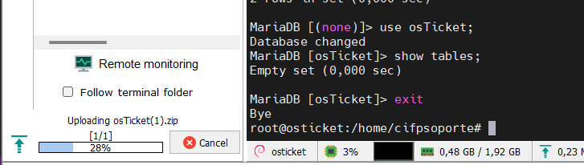

- [osTicket](#osticket)
  - [Tutoriales](#tutoriales)
  - [Creación de MV en Proxmox](#creación-de-mv-en-proxmox)
    - [Usuario Sistema Operativo](#usuario-sistema-operativo)
  - [Instalación](#instalación)
    - [Instalación de dependencias](#instalación-de-dependencias)
    - [Configuracion segura de la BBDD](#configuracion-segura-de-la-bbdd)
    - [Creación de tablas y usuario (MariaDB)](#creación-de-tablas-y-usuario-mariadb)
    - [Descargamos osTicket](#descargamos-osticket)
    - [Configuración gráfica](#configuración-gráfica)

-----------
**********

# osTicket

## Tutoriales

Tutorial de uso y explotación de osTicket.

https://www.youtube.com/@osTicket_tutorials/videos

Aplicación para administrar desde el móvil.

https://play.google.com/store/apps/details?id=br.com.osticket.admin&hl=es_PE

## Creación de MV en Proxmox

Tomamos como base Debian-12.2.0


### Usuario Sistema Operativo

No tiene clave de root. 

Usua: cifpsoporte
Pass: 2324Ceuta

## Instalación

### Instalación de dependencias

Preparación de entorno del S.O. para la instalación de osTicket.

```Bash
sudo apt update
sudo apt upgrade
cd ~
touch ~/.Xauthority
sudo apt install -y apache2 php8.2 mariadb-server
sudo apt install -y php-zip
sudo apt-get install -y php-mysqli php-gd php-imap php-xml php-dom php-json php-mbstring php-phar php-intl php-apcu php-opcache
sudo systemctl restart apache2
```

### Configuracion segura de la BBDD
```Bash
sudo mysql_secure_installation
```

### Creación de tablas y usuario (MariaDB)
```
sudo su
mysql -u root

create database osTicket;
create user osTicket;
set password for 'osTicket' = password('osTicket');
grant all privileges on osTicket.* to 'osTicket'@'%';
flush privileges;
```

### Descargamos osTicket

Por políticas de empresa hay que descargar osTicket desde la web del fabricante. Así que a través de un navegador web, descargamos el paquete y nos lo subimos a la carpeta /home/cifpsoporte, para posteriormente descomprimir, copiar el archivo de idioma y copiar los archivos /var/www/html/osticket.

https://osticket.com/download/



Una vez descargado en la carpeta `/home/cifpsoporte` iniciamos el proceso de instalación.

```Bash
root@osticket:/home/cifpsoporte# sudo apt install unzip
root@osticket:/home/cifpsoporte# unzip osTicket.zip -d osTicket
Archive:  osTicket.zip
  inflating: osTicket/osTicket-v1.18.1.zip
  inflating: osTicket/es_ES.phar
root@osticket:/home/cifpsoporte# ls
osTicket  osTicket.zip
root@osticket:/home/cifpsoporte# cd osTicket
root@osticket:/home/cifpsoporte/osTicket# unzip osTicket-v1.18.1.zip -d ./osTicket

// Archivo de idioma
root@osticket:/home/cifpsoporte/osTicket# mv es_ES.phar ./osTicket/upload/include/i18n/

// Movemos las carpetas a /var/www/html/osTicket
root@osticket:/home/cifpsoporte/osTicket# cd osTicket
root@osticket:/home/cifpsoporte/osTicket/osTicket# mkdir /var/www/html/osTicket
root@osticket:/home/cifpsoporte/osTicket/osTicket# cp -r ./* /var/www/html/osTicket/
root@osticket:/home/cifpsoporte/osTicket/osTicket# ls /var/www/html/osTicket/
scripts  upload

// Copiamos archivos de configuración
root@osticket:/var/www/html/osTicket/upload/include# cp /var/www/html/osTicket/upload/include/ost-sampleconfig.php /var/www/html/osTicket/upload/include/ost-config.php
root@osticket:/var/www/html/osTicket/upload/include# chmod 0666 /var/www/html/osTicket/upload/include/ost-config.php

```

### Configuración gráfica

Desde un navegador configuramos el resto de la instalación

http://192.168.1.143/osTicket/upload/setup/


> Admin: root  
> Passw: 2324Ceuta


Los datos de conexión de la BBDD deben coincidir con los que hemos puesto durante la creacion de ususarios y BBDD en el apartado de MariaDB

> Base de datos: osTicket  
> Nombre usuario: osTicket  
> Password: osTicket  


En la parte inferior tenemos las URL de la generación y gestión de tickets. 

Y por último eliminamos los permisos del fichero ost-config.php
y renombramos la carpeta setup por motivos de seguridad.

```Bash
root@osticket:/var/www/html/osTicket/upload/include# chmod 0644 /var/www/html/osTicket/upload/include/ost-config.php
root@osticket:/home/cifpsoporte# mv /var/www/html/osTicket/upload/setup/ /var/www/html/osTicket/upload/setup.seg
```


